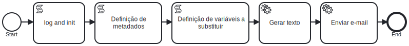

# Envio de E-mail com Geração de Texto via Template

> 📢 **Uso de Template no Toolkit TKTEMPL_SgppTemplates (TKTEMPL)**
> 
> Este *building block* possui um template disponível no toolkit **TKTEMPL_SgppTemplates (TKTEMPL)**. A menos que existam motivos técnicos ou operacionais razoáveis para uma implementação personalizada, o uso do template é altamente recomendado.
> 
> ✅ **Vantagens de utilizar o template:**
> - Padronização e conformidade com boas práticas.
> - Manutenção simplificada e suporte contínuo.
> - Redução de esforço e tempo de desenvolvimento.
> 
> Caso haja necessidade de uma implementação alternativa, recomenda-se justificar a decisão e avaliar possíveis impactos.
> 
> 🔗 Consulte a documentação do **TKTEMPL_SgppTemplates** para mais detalhes sobre o template disponível.

🔍️ **Local de criação:** IBM BAW  
⌛️ **Tempo estimado:** 6 a 8 horas  
📨 **Função:** Geração de conteúdo textual e envio automatizado de e-mail com template HTML

---

## Diagrama BPMN



---

## Etapas de Execução

### 1. `log and init`
**Tipo:** Script  
**Objetivo:** Inicializar variáveis locais e registrar informações básicas no log.  
**Exemplo:**
```javascript
tw.local.serviceName = "EnvioEmailComTemplateService";
log.info("Serviço: " + tw.local.serviceName);
```

---

### 2. `Definição de Metadados`
**Tipo:** Script  
**Objetivo:** Definir informações padrão do e-mail.  
**Exemplo:**
```javascript
tw.local.smtpHost = tw.env.SMTP_SERVER_EV;
tw.local.contentType = "text/html";
tw.local.bcc = "";
tw.local.cc = "";
tw.local.from = "";
tw.local.replyTo = "";
tw.local.subject = "";
tw.local.to = "";
tw.local.compactarAnexos = false;
```

---

### 3. `Definição de Variáveis a serem Substituídas`
**Tipo:** Script  
**Objetivo:** Informar o nome do template e as variáveis a serem substituídas.  
**Exemplo:**
```javascript
tw.local.nomeArquivoTemplate = "exemplo_email_template.html";
tw.local.verificarVariaveisNPopuladas = true;
tw.local.mapaVariaveisSubistituicao = [
  {"name":"variavelDeSubstituicao", "value":"Texto substituído com sucesso!"}
];
```

---

### 4. `Gerar texto`
**Tipo:** Serviço  
**Serviço:** `Gerar Texto de Template SF`  
**Toolkit:** `TKISC_IntegracoesSistemicasComuns`  
**Função:** Gerar corpo do e-mail substituindo variáveis no HTML.

> ⚠️ O arquivo de template deve ser adicionado ao Process App como um **Server File**.  
> Exemplo de conteúdo de arquivo:
```html
<html>
  <body>
    <p>Esse e-mail é um exemplo da funcionalidade "Gerar Texto de Template SF": ${variavelDeSubstituicao}.</p>
  </body>
</html>
```

---

### 5. `Enviar e-mail`
**Tipo:** Serviço  
**Serviço:** `Enviar Email com Anexos SF`  
**Toolkit:** `TKISC_IntegracoesSistemicasComuns`  
**Função:** Enviar o e-mail com o conteúdo gerado no passo anterior.

---

### 6. Encerramento
**Tipo:** Fim do processo  
**Objetivo:** Encerrar o fluxo após o envio do e-mail com sucesso.
