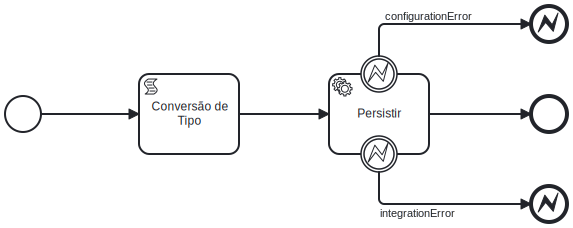

# Serviços de Persistência via General Purpose Entity

🔍️ **Local de criação:** IBM BAW  
⌛️ **Tempo estimado:** 30 minutos  
🔧 **Função:** Realizar chamada a serviço de persistência de objeto General Purpose, que permite persistir BO definido no IBM BAW sem a necessidade de defini-lo no backend  

### Diagrama BPMN


## Etapas de execução

### 1. Definir parâmetros de entrada, saída e privados

**Variáveis entrada:** As seguintes variáveis devem ser definidas:
- Variável do tipo a ser persistido

**Variáveis saída:** As seguintes variáveis devem ser definidas:
- **id**  do tipo String
- **version** do tipo Integer

**Variáveis privadas:** As seguintes variáveis devem ser definidas:
- **data**  do tipo String

### 2. Adicionar Script de Conversão de tipo de entrada *(etapa condiciona a existir um parâmetro de entrada no serviço)*
**Nome:** Conversão de Tipo  
**Função:** Converter o tipo de entrada do formato ANY, para o formato  do serviço que esse serviço encapsula.  
Deve-se observar se o parâmetro de entrada ou é um objeto ou é um JSON  
Esse parâmetro pode ser fatorado em quantos atributos de entrada forem necessários. Os nomes dessas variáveis também devem se referir aos nomes dos atributos de entrada

**Exemplo:**
```javascript
var data = null;
if (typeof tw.local.data === 'string') {
    data = tw.local.data;
} else {
    data = JSON.stringify(tw.local.data);
}
tw.local.data = JSON.parse(data);
```

### 3. Usar Linked Services Persistir Geral Purpose Entity SF do  *toolkit TKISC_IntegracoesSistemicasComuns*
**Nome:** Persistir Geral Purpose Entity SF  
**Função:** Serviço que persiste um objeto genérico no formato json.  
Deve-se ficar atento com os parâmetros de entrada para utilizar o serviço. Os valores de entrada são estes:
- **JsonObject** do tipo String  
Valor: Variável manipulada na tarefa anterior
- **GeralPurposeBOName** do tipo String  
Valor: Inserir o nome do BO que será utilizado no serviço entre aspas duplas exemplo: 
```javascript
"TransferenciaLancamentosBO"
```
- **Token** do tipo String  
Valor: tw.env.SERVICES_JWT_TOKEN_EV
- **BaseUrl** do tipo String
Valor: tw.env.SERVICES_BASE_URL_EV
- **TentativasConflito** do tipo Integer  
Valor: 0

**Boundary Event:** Adicionar um boundary event para capturar erro *ConfigurationError*.  
**Boundary Event:** Adicionar um boundary event para capturar erro *IntegrationError*.

**Exemplo:**  
