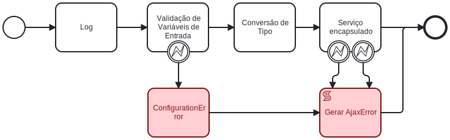

# Serviço REST Assíncrono

> 📢 **Uso de Template no Toolkit TKTEMPL_SgppTemplates (TKTEMPL)**
> 
> Este *building block* possui um template disponível no toolkit **TKTEMPL_SgppTemplates (TKTEMPL)**. A menos que existam motivos técnicos ou operacionais razoáveis para uma implementação personalizada, o uso do template é altamente recomendado.
> 
> ✅ **Vantagens de utilizar o template:**
> - Padronização e conformidade com boas práticas.
> - Manutenção simplificada e suporte contínuo.
> - Redução de esforço e tempo de desenvolvimento.
> 
> Caso haja necessidade de uma implementação alternativa, recomenda-se justificar a decisão e avaliar possíveis impactos.
> 
> 🔗 Consulte a documentação do **TKTEMPL_SgppTemplates** para mais detalhes sobre o template disponível.

🔍️ **Local de criação:** IBM BAW  
⌛️ **Tempo estimado:** 4 horas  
🔧 **Função:** Encapsular um serviço já criado para utilizá-lo no elemento de Coach *Service call*  
🏷️ **Nome:** O nome desse serviço deve ser o mesmo do serviço encapsulado + "AS"

### Diagrama BPMN


### Pré requisitos
Ter um serviço do tipo **Serviço REST no IBM BAW** já criado. Vide [Configuração do Serviço REST no IBM BAW](servicos-rest.md)  
O Ajax Acces desse serviço deve ser definido para permitir chamadas de  qualquer usuário


## Etapas de execução

### 1. Definir parâmetros de entrada, saída e privados
- **Parâmetros de entrada:** Obrigatoriamente deve ser definido um parâmetro de entrada chamado data do tipo *ANY* do toolkit System Data  
- **Parâmetros de saída:** Obrigatoriamente deve ser definido um parâmetro de saída chamado error do tipo *AjaxError* do toolkit *UI Toolkit*  
Caso serviço encapsulado retorne algo, um parâmetro chamado results deverá ser definido para retorná-lo
- **Variáveis privadas:** Devem ser definidas quantas variáveis privadas forem necessárias, mas minimamente as seguintes variáveis devem ser definidas
- **localError:** do tipo *ErrorBO* definido no toolkit *TKHE_HandleError*

### 2. Adicionar Componente de Script para Log:
**Nome:** log
**Função:** Logar as entradas do serviço, incluindo o nome do serviço e o conteúdo de cada variável de entrada.
**Exemplo:**
```javascript
log.info("Serviço: " + *serviceName*);
log.info("Variáveis de entrada: " + JSON.stringify(tw.local.data));
```

### 3. Adicionar Script de Validação de Variáveis de Entrada  *(etapa condiciona a existir um parâmetro de entrada no serviço) :*
**Nome:** Validação de Variáveis de Entrada
**Função:** Validar as variáveis obrigatórias de entrada.
**Erro:** Lançar um Error com a mensagem "O parâmetro de entrada *nomeDaVariavel* não pode ser nulo" quando uma variável obrigatória não foi definida.
**Boundary Event:** Adicionar um boundary event para capturar esse erro.
**Exemplo:**
```javascript
if (!tw.local.data) {
    throw new Error("O parâmetro de entrada data não pode ser nulo");
}
```

### 4. Adicionar Script de Conversão de tipo de entrada *(etapa condiciona a existir um parâmetro de entrada no serviço)*
**Nome:** Conversão de Tipo
**Função:** Converter o tipo de entrada do formato *ANY*, para o formato  do serviço que esse serviço encapsula.  
Deve-se observar se o parâmetro de entrada é um objeto ou é um JSON  
Esse parâmetro pode ser fatorado em quantos atributos de entrada forem necessários. Os nomes dessas variáveis também devem se referir aos nomes dos atributos de entrada do serviço encapsulado
**Exemplo:**
```javascript
var data = null;
if (typeof tw.local.data === 'string') {   data = JSON.stringify(tw.local.data); } else {
    data = tw.local.data;
}
tw.local.entrada = data;
```

### 5. Adicionar o Services encapsulado já criado :
**Nome:** *O nome deve ser o nome do serviço*  
**Função:** Exceutar o serviço encapsulado  
**Configuração:** Configure as propriedades do serviço para utilizar os parâmetros previamente montados.  
Caso houver, configure o parâmetro de saída desse serviço
**Erro:** Esse serviço lança uma exceção do tipo *IntegrationError* (que  retorna um objeto do tipo *ErrorBO*) e um do tipo ConfigurationError (que retorna um objeto do tipo *ErrorBO*), 
definidos no toolkit *TKISC_IntegracoesSistemicasComuns*.
**Boundary Event:** Adicionar um boundary event para cada um desses erros
**Saída:** Esse boundary event retorna um objeto do tipo ErrorBO definido no toolkit *TKHE_HandleErrors*. Esse objeto deve ser aplicado como *Error mapping* a um evento de finalização de erro de nome *IntegrationError End Event* cujo *Error Code* deve ser *IntegrationError ou ConfigurationError End Event* cujo *Error Code* deve ser ConfigurationError de acordo com o boundary event

### 6. Usar Linked Service Generate Error Object SF do toolkit  
*TKHE_HandleErrors* no fluxo do boundary event associado ao serviço Validação de Variáveis de Entrada
**Nome:** ConfigurationError
**Cor:** vermelho
**Função:** Gerar objeto de exceção que deve ser passado para uma evento de finalização de erro
**Configuração:** Configure a propriedade *tw.system.error* como o parâmetro de entrada *systemError*  
Configure uma String com o nome do serviço como parâmetro de entrada *serviceName*
**Saída:** Esse serviço retorna um objeto do tipo *ErrorBO* definido no toolkit *TKHE_HandleErrors*. Esse objeto deve ser aplicado como *Error mapping* a um evento de finalização de erro de nome *ConfigurationError End Event* cujo *Error Code* deve ser *ConfigurationError* e no qual o objeto *localError* deve ser passado como o parâmetro *Error mapping*

### 7. Usar Script no fluxo dos boundary event's
**Nome:** Gerar AjaxError  
**Cor:** vermelho  
**Função:** Gerar objeto de exceção que deve ser passado para o evento  de finalização  
**Saída:** Esse script retorna um objeto do tipo AjaxError definido com os dados do ErrorBO recebido dos boundary events  
**Exemplo:**  
```javascript
tw.local.error = {};
tw.local.error.errorText = tw.local.localError.message; tw.local.error.errorCode = tw.local.localError.errorCode; tw.local.error.serviceInError = "NOME_DO_SERIÇO";
```
