# Serviços REST

🔍️ **Local de criação:** IBM BAW  
⌛️ **Tempo estimado:** 8 horas  
🔧 **Função:** Realizar uma chamada a uma interface backend  

### Diagrama BPMN


## Etapas de execução

### 1. Definir parâmetros de entrada, saída e privados

**Parâmetros de entrada:** Caso seja necessário passar parâmetros para a chamada, uma ou mais variáveis devem ser definidas para receber os valores desses parâmetros  
**Parâmetros de saída:** Caso a chamada retorne algum dado, a variável de saída deve ser definida  
**Variáveis privadas:** Devem ser definidas quantas variáveis privadas forem necessárias, mas minimamente as seguintes variáveis  devem ser definidas:  
- **serviceName** do tipo String
- **url** do tipo String
- **response** do tipo String
- **error** do tipo ErrorBO definido no toolkit TKHE\_HandleErrors
- **errorResponse** - do tipo ErrorResponse definido no toolkit *TKISC\_IntegracoesSistemicasComuns*

### 2. Adicionar Componente de Script para Log:

**Nome:** log  
**Função:** Logar as entradas do serviço, incluindo o nome do serviço e o conteúdo de cada variável de entrada.  
**Exemplo:**
```javascript
tw.local.serviceName = /*nome_do_servico*/  
log.info("Serviço: "+tw.local.serviceName);
log.info("Variáveis de entrada: " + JSON.stringify(/*tw.local.NOMEVARIAVEL*/) + ", " + /*...Repetir para as demais variáveis*/);
```

### 3. Adicionar Script de Validação de Variáveis de Entrada  *(etapa condiciona a existir um parâmetro de entrada no serviço)*

**Nome:** Validação de Variáveis de Entrada  
**Função:** Validar as variáveis obrigatórias de entrada.  
**Erro:** Lançar um Error com a mensagem "O parâmetro de entrada *nomeDaVariavel* não pode ser nulo" quando uma variável obrigatória não foi definida.  
**Boundary Event:** Adicionar um boundary event para capturar esse erro.  
**Exemplo:**

```javascript
if (!inputVariable1) {
    throw new Error("O parâmetro de entrada inputVariable1 não pode ser nulo");
}
// Repita para outras variáveis obrigatórias
```

### 4. Adicionar Script para Montar URL/Payload:

**Nome:** Montar URL/Payload  
**Função:** Construir a URL com parâmetros usando como base a variável  de ambiente SERVICES\_BASEURL.  
**Montagem da URL**: A url deve ser montada de acordo com o definido no backend. Caso existam parâmetros na url, esses devem ser definidos.  
**Escapamento da URL:** Utilizar o método encodeURI para escapar a URL.  
**Transformação do Payload *(atividade condiciona ao endpoint aceitar ou não um payload)*:** Transformar o payload em string com o  método *JSON.stringify*.  
**Exemplo:**
```javascript
//substitua o nome endpoint, inputVariable e inputVariable2 pelos objetos de entrada apropriados
var baseUrl = tw.env.SERVICES\_BASEURL;
tw.local.url = encodeURI(baseUrl + "/endpoint/" + inputVariable); tw.local.payload = JSON.stringify(inputVariable2);
```

### 5. Usar Linked Services HTTP do toolkit *TKISC_IntegracoesSistemicasComuns* :

**Nome:** O nome deve ser o nome do método HTTP: *GET*, *POST*, *PUT* ou *DELETE*  
**Função:** Realizar uma chamada REST ao backend  
**Adicionar o Serviço ao fluxo:** Adicione o elemento de serviço correspondente ao método HTTP necessário no diagrama. Os Linked Services se encontram no toolkit **TKISC_IntegracoesSistemicasComuns**  com os nomes **Call Get SF**, **Call Post SF**, **Call Put SF** e **Call  Delete SF**, de acordo com o tipo de chamada HTTP desejada  
**Configuração:**
- Configure as propriedades do serviço para utilizar a URL e o payload (quando aplicável) previamente montados.
- Configure a variável de ambiente *tw.env.SERVICES_JWT_TOKEN_EV* na propriedade token. 
- Configure o atributo response como saída desse serviço

### 6. Usar Linked Services *Verify Response REST Service SF*  do toolkit *TKISC_IntegracoesSistemicasComuns :*

**Nome:** Verificar Response  
**Função:** Gerar Exceção caso a chamada prévia de chamada REST tiver lançado uma exceção  
**Configuração:**
- Configure a propriedade response, passando o valor retornado pelo serviço de chamada REST executado previamente.
- Configure a mesma variável como parâmetro de saída.
- Configure a propriedade permitirRespostaVazia como true caso a resposta possa vir vazia, false no caso contrário  

**Erro:** Esse serviço lança uma exceção do tipo *IntegrationError*, passando um objeto do tipo *ErrorResponse*, definido no toolkit **TKISC_IntegracoesSistemicasComuns**.  
**Boundary Event:** Adicionar um boundary event para capturar esse erro.

### 7. Adicionar Script para Definir Variáveis de Saída:

**Nome:** Definir Variáveis de Saída  
**Função:** Fazer o parse da saída do método REST como objeto do IBM BAW   
**Transformação do Response:** Transformar o response String em um objeto do IBM BAW com a função JSON.parse().    
**Exemplo:**
```javascript
//substitua o nome responseObject pelo objeto de saída 
tw.local.responseObject = JSON.parse(responseString);
```

### 8. Usar Linked Service *Generate Error Object SF* do toolkit *TKHE_HandleErrors* no fluxo do boundary event associado ao serviço *Validação de Variáveis de Entrada*

**Nome:** ConfigurationError  
**Cor:** vermelho  
**Função:** Gerar objeto de exceção que deve ser passado para uma evento de finalização de erro  
**Configuração:**
- Configure a propriedade *tw.system.error* como o parâmetro de entrada *systemError*
- Configure a variável tw.local.serviceName como parâmetro de entrada *serviceName*

**Saída:** Esse serviço retorna um objeto do tipo ErrorBO definido no toolkit *TKHE_HandleErrors*. Esse objeto deve ser aplicado como *Error mapping* a um evento de finalização de erro de nome *ConfigurationError End Event* cujo *Error Code* deve ser *ConfigurationError* e no qual o objeto error deve ser passado como o parâmetro *Error mapping*

### 9. Usar Linked Service *Generate Error Object from REST SF* do toolkit  *TKHE_HandleErrors* no fluxo do boundary event associado ao serviço *Verificar Response*

**Nome:** IntegrationError  
**Cor:** vermelho  
**Função:** Gerar objeto de exceção que deve ser passado para uma evento de finalização de erro  
**Configuração:**
- Configure a propriedade *tw.local.errorResponse.message* como o parâmetro de entrada message Configure a propriedade *tw.local.errorResponse.code* como o parâmetro de entrada *httpCode*
- Configure a propriedade *tw.local.errorResponse.sgppExceptionId* como o parâmetro de entrada *sgppServicesId*
- Configure a variável *tw.local.serviceName* como parâmetro de entrada *serviceName*

**Saída:** Esse serviço retorna um objeto do tipo ErrorBO definido no toolkit **TKHE_HandleErrors**. Esse objeto deve ser aplicado como *Error mapping* a um evento de finalização de erro de nome *IntegrationError End Event* cujo *Error Code* deve ser *IntegrationError* e no qual o objeto error deve ser passado como o parâmetro *Error mapping*
