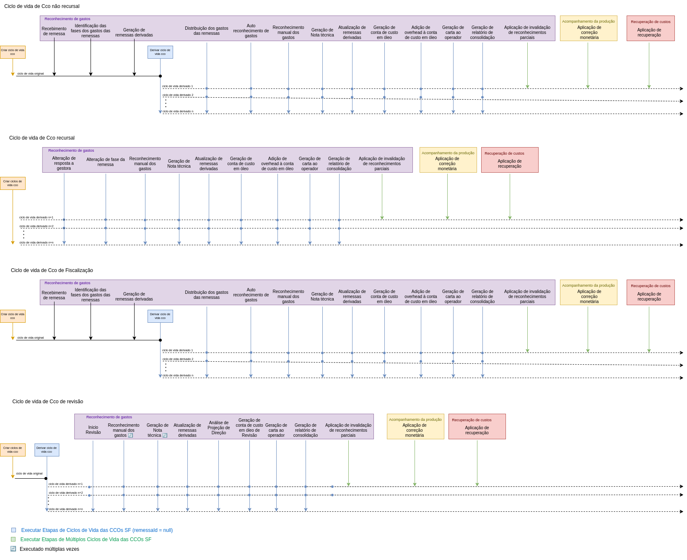

# Criação de Etapas do Ciclo de Vida de Contas de Custo em Óleo

🔍️ **Local de criação:** `sgpp-services`  
⌛️ **Tempo estimado:** 8 horas + tempo para desenvolver regra de negócio + tempo para desenvolver teste unitário da regra de negócio

---

## Etapas de Execução

### 1. Criar Classe de API REST

📦️ **Pacote:** `sgpp.services.web.rest`  
🏷️ **Nome:** Deve refletir o nome da etapa, iniciando com `Etapa` e terminando com `Resource`.  
📄 **Descrição:** Classe que expõe a etapa do ciclo de vida como API REST. Deve possuir apenas um método com a seguinte assinatura:

```java
sgpp.services.web.rest.EtapaAdicaoOverheadContaCustoOleoResource.executar(...)
```

🔹 Esse método deve:
- Receber todos os parâmetros necessários para a composição do input da etapa.
- Instanciar a classe de _Requisição_.
- Buscar na base os dados necessários para popular essa classe.
- Utilizar o método:
  ```java
  sgpp.services.service.EventStoreClient.addEtapa(EtapaBaseEvent)
  ```
  para adicionar a etapa na fila de execução.

💡 **Dica:** Faça com que os parâmetros do método `executar` sejam o mais resumidos possíveis. O estado da aplicação pode ser consultado na base de dados, então, sempre que possível, utilize identificadores como inputs.

---

### 2. Criar Classe de Requisição (Input de Dados) da Etapa

📦️ **Pacote:** `sgpp.ciclovidacco.etapas.[NomeDaEtapaCamelCase].[NumeroVersao]`  
🏷️ **Nome:** Deve refletir o nome da etapa, iniciando com `Etapa` e terminando com `Requisicao`.  
📤️ **Ascendência:** Deve estender `sgpp.ciclovidacco.etapas.EtapaRequisicao`.  
#️⃣ **Anotações:** Deve conter as anotações:
  - `@lombok.Data`
  - `@lombok.EqualsAndHashCode(callSuper = false)`
  - `@lombok.ToString`
  
📄 **Descrição:** Esta classe representa um _Value Object_ contendo todo o estado da regra de negócio modelada na etapa. Durante a execução da etapa, o estado da aplicação não deve ser consultado na base (com algumas exceções). Todos os objetos de valor devem ser atributos dessa classe.

▶️ **Métodos:** Deve conter um método de criação com a seguinte assinatura:

```java
public static [NomeDaClasse] criarEtapa(...)
```

#### 2.1. Definir o atributo como vínculo
📄 **Descrição:** Como o ciclo de vida tem a característica de ser reexecutado, é necessário definir um atributo que carrega as alterações realizadas pela etapa anterior. Para tanto, é necessário identificar esse atributo (que na maior parte das vezes é ou RemessaEntity ou ContaCustoOleoEntity).
Para realizar esa identificação, a seguinte anotação deve ser adicionada à esse atributo
```
@EtapaPreviaVinculo(value = "...", nomeItem = "...")
```
Como `value`deve ser passado o FQN da classe enquanto `nomeItem` deve ser passado o nome do atributo conforme ele é na etapa anterior

---

### 3. Criar Classe da Etapa

📦️ **Pacote:** `sgpp.ciclovidacco.etapas.[NomeDaEtapaCamelCase].[NumeroVersao]`  
🏷️ **Nome:** Deve refletir o nome da etapa.  
📤️ **Ascendência:** Deve estender `sgpp.ciclovidacco.etapas.EtapaImpl`.  
📄 **Descrição:** Classe que contém a regra de negócio e deve obedecer às seguintes diretrizes:
- **Idempotência:** Execuções consecutivas devem sempre alterar o estado da mesma forma, ou seja, sem efeitos colaterais indesejados.
- **Isolamento do Estado:** Não deve consultar o estado da aplicação diretamente. Todos os dados devem vir da classe _Requisicao_.
- **Tratamento de Exceções:** Toda execução deve ser encapsulada em um `try-catch` para capturar `java.lang.Exception`.

▶️ **Métodos:** Deve conter apenas um método público com a seguinte assinatura:

```java
public void executar(EtapaRequisicaoImpl etapaRequisicao)
```

#### 3.1. Definir o Método `executar` da Etapa

📄 **Descrição:** O método `executar` deve chamar os seguintes métodos:

- **Alteração de Estado:**
  ```java
  sgpp.services.service.EventoPendenteService.addEvent(BaseEvent, EtapaRequisicao)
  ```
  
- **Tratamento de Exceção:**
  ```java
  sgpp.ciclovidacco.etapas.EtapaImpl.lancarExcecaoConclusaoEtapa(CicloVidaCcoService, EtapaRequisicaoImpl, Exception)
  ```
  
- **Finalização da Etapa:**
  ```java
  sgpp.services.contacustooleo.ciclovida.CicloVidaCcoService.concluirEtapa(EtapaBaseEvent)
  ```

---

### 4. Atualizar a Criação do Ciclo de Vida de Contas de Custo em Óleo

▶️ **Métodos:** Modificar o método:

```java
sgpp.services.contacustooleo.ciclovida.CicloVidaCcoService.createCicloVidaDefault(FaseRemessaEnum, String, boolean iniciadoEmFaseRecursiva)
```

🔹 Esse método deve considerar em qual processo a etapa será ativada e utilizar:

```java
sgpp.services.contacustooleo.ciclovida.CicloVidaCcoEntity.adicionarEtapaNoFim(CicloVidaCcoEtapaEnum, CicloVidaCcoEtapaVersaoLogicaEnum, CicloVidaCcoEtapaVersaoRequisicaoEnum)
```

🔹 Criar um item correspondente na enumeração:

```java
sgpp.services.contacustooleo.ciclovida.CicloVidaCcoEtapaEnum
```

para representar a nova etapa.

---

### 5. Atualizar o Diagrama do Estado Atual do Ciclo de Vida de Contas de Custo em Óleo

📄 **Descrição:** Atualizar o [diagrama do ciclo de vida](img/etapas_ciclo_vida.drawio) e substituir a imagem abaixo:



### 6. Atualização e Versionamento de Etapas

📄 **Descrição:** Toda etapa deve ser criada em um pacote que expõe a sua versão, por exemplo: `v1_0_0`.

🔹 **Atualizações menores** que não envolvem a alteração dos objetos de _Requisição_ e seus atributos, e que não modificam drasticamente as regras de negócio, podem ser feitas diretamente nas classes desse pacote.

🔹 **Versionamento necessário:** Caso o objeto de _Requisição_ seja alterado ou a regra de negócio sofra mudanças significativas, uma nova versão da etapa deve ser criada.

📦 **Procedimento para versionamento:**
- Criar um novo pacote que represente a nova versão, por exemplo: `v1_1_0`.
- Duplicar todas as classes internas da versão anterior.
- A nova versão **não** deve utilizar classes da versão antiga.
- Criar uma classe de adaptação que estenda:

  ```java
  sgpp.ciclovidacco.etapas.adaptacao.AdaptadorEtapaRequisicaoAbstract<ORIGEM, ALVO>
  ```

- Anotar a classe com (as versões anotadas referem-se à versão anterior e à nova versão, respectivamente):
  ```java
  @Adaptacao(versaoOrigem = "1.0.0", versaoAlvo = "2.0.0")
  ```
- Implementar o método:
  ```java
  sgpp.ciclovidacco.etapas.adaptacao.AdaptadorEtapaRequisicaoAbstract.converter(ORIGEM)
  ```
  para realizar a conversão do objeto de _Requisição_ da versão antiga para a nova.

