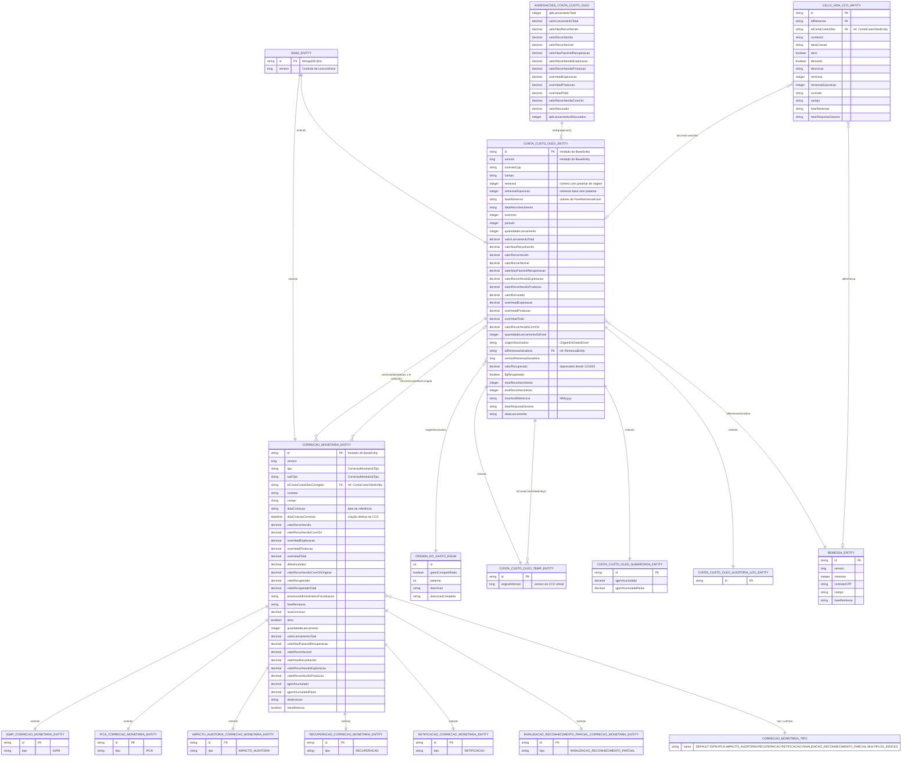

# ContaCustoOleoEntity

🔍️ **Módulo:** `sgpp-services`  
📦️ **Pacote:** `sgpp.services.contacustooleo`  
🗄️ **Coleção MongoDB:** `conta_custo_oleo_entity`  
🧬 **Ascendência:** `sgpp.services.common.BaseEntity`  
🏷️ **Anotações:** `@Document`, `@QueryEntity`, `@Data`, `@EqualsAndHashCode(callSuper = false)`

---

## Visão geral

`ContaCustoOleoEntity` (CCO) é o **agregado raiz** da conta de custo em óleo no SGPP. Representa o saldo/valores de reconhecimento de uma remessa em um contrato CPP e campo, com overhead de exploração/produção e histórico de **correções monetárias** embutidas.

A CCO é tipicamente **gerada a partir de uma remessa** (`idRemessaGeradora` + `versionRemessaGeradora`) e alimentada por agregações de gastos (`AgregacoesContaCustoOleo` / `setAgregacoes`).

| Aspecto | Detalhe |
| --- | --- |
| Persistência | MongoDB — documento único por CCO |
| Vínculo com remessa | `idRemessaGeradora` → `RemessaEntity` |
| Correções | Lista embutida `correcoesMonetarias` (`CorrecaoMonetariaEntity` e subtipos) |
| Recuperação | `flgRecuperado` + tipos `RECUPERACAO` (formato atual); `valorRecuperado` deprecated |
| Staging | `ContaCustoOleoTempEntity` (`conta_custo_oleo_temp_entity`) |

---

## Diagrama Entidade-Relacionamento (DER)

O diagrama abaixo modela `ContaCustoOleoEntity` e as classes/coleções mais diretamente relacionadas (composição embutida, herança e referências lógicas).

> 📎 **Recurso estático:** o mesmo diagrama Mermaid está versionado em [`/der/conta-custo-oleo-entity.mmd`](/der/conta-custo-oleo-entity.mmd) (`static/der/conta-custo-oleo-entity.mmd`).

---

## Classes e relacionamentos

### Agregado principal

| Classe | Coleção / papel | Relação com `ContaCustoOleoEntity` |
| --- | --- | --- |
| `BaseEntity` | — | Superclasse (`id`, `version`) |
| `ContaCustoOleoEntity` | `conta_custo_oleo_entity` | Agregado raiz |
| `CorrecaoMonetariaEntity` | embutido em `correcoesMonetarias`; também `correcao_monetaria_pendente_entity` | Composição **1:N** (e staging pendente) |
| `AgregacoesContaCustoOleo` | value object | Popula totais da CCO via `setAgregacoes()` |

### Especializações da CCO

| Classe | Coleção / papel | Observação |
| --- | --- | --- |
| `ContaCustoOleoTempEntity` | `conta_custo_oleo_temp_entity` | Staging; `originalVersion` + `toContaCustoOleoEntity()` |
| `ContaCustoOleoSumarizadaEntity` | projeção em memória | CCO “achatada” na última correção (`igpmAcumulado*`) |
| `ContaCustoOleoAuditoriaLogEntity` | `conta_custo_oleo_auditoria_log_entity` | Log/histórico de auditoria |

### Especializações de correção monetária

| Classe | `CorrecaoMonetariaTipo` | Uso |
| --- | --- | --- |
| `IgmpCorrecaoMonetariaEntity` | `IGPM` | Correção de aniversário IGPM |
| `IpcaCorrecaoMonetariaEntity` | `IPCA` | Correção de aniversário IPCA |
| `ImpactoAuditoriaCorrecaoMonetariaEntity` | `IMPACTO_AUDITORIA` | Impacto de auditoria/glosa |
| `RecuperacaoCorrecaoMonetaryEntity` | `RECUPERACAO` | Dedução/recuperação de valor |
| `RetificacaoCorrecaoMonetariaEntity` | `RETIFICACAO` | Retificação (com `subTipo` / observação) |
| `InvalidacaoReconhecimentoParcialCorrecaoMonetariaEntity` | `INVALIDACAO_RECONHECIMENTO_PARCIAL` | Invalidação de reconhecimento parcial |

### Referências lógicas (outras coleções)

| Classe | Coleção | Vínculo |
| --- | --- | --- |
| `RemessaEntity` | `remessa_entity` | `ContaCustoOleoEntity.idRemessaGeradora` (+ `versionRemessaGeradora`) |
| `CicloVidaCcoEntity` | `ciclo_vida_cco_entity` | `idContaCustoOleo` (e `idRemessa`) |

### Domínios controlados

| Enum | Uso principal |
| --- | --- |
| `OrigemDoGastoEnum` | Origem dos gastos da CCO e coerência com o patamar da remessa |
| `CorrecaoMonetariaTipo` | Tipo/subtipo da correção embutida |
| `FaseRemessaEnum` | `faseRemessa` alinhada ao ciclo da remessa |

---

## Atributos de `ContaCustoOleoEntity`

| Atributo | Tipo | Notas |
| --- | --- | --- |
| `id` | `String` | PK MongoDB (herdado) |
| `version` | `Long` | Concorrência otimista (herdado) |
| `contratoCpp` | `String` | Contrato de partilha |
| `campo` | `String` | Campo / área |
| `remessa` | `Integer` | Número da remessa (pode incluir patamar) |
| `remessaExposicao` | `Integer` | Remessa base sem patamar |
| `faseRemessa` | `String` | Fase processual |
| `dataReconhecimento` | `String` | Data de reconhecimento |
| `exercicio` | `Integer` | Exercício fiscal |
| `periodo` | `Integer` | Período |
| `quantidadeLancamento` | `Integer` | Qtd. de lançamentos |
| `valorLancamentoTotal` | `BigDecimal` | Valor total lançado |
| `valorNaoReconhecido` | `BigDecimal` | Não reconhecido |
| `valorReconhecido` | `BigDecimal` | Reconhecido (sem OH) |
| `valorReconhecivel` | `BigDecimal` | Passível de reconhecimento |
| `valorNaoPassivelRecuperacao` | `BigDecimal` | Não passível de recuperação |
| `valorReconhecidoExploracao` | `BigDecimal` | Parcela exploração |
| `valorReconhecidoProducao` | `BigDecimal` | Parcela produção |
| `valorRecusado` | `BigDecimal` | Recusado |
| `overHeadExploracao` | `BigDecimal` | OH exploração (default 0) |
| `overHeadProducao` | `BigDecimal` | OH produção (default 0) |
| `overHeadTotal` | `BigDecimal` | OH total (default 0) |
| `valorReconhecidoComOH` | `BigDecimal` | Reconhecido com overhead |
| `quantidadeLancamentoDaFase` | `Integer` | Qtd. na fase corrente |
| `origemDosGastos` | `OrigemDoGastoEnum` | Origem / patamar |
| `idRemessaGeradora` | `String` | FK lógica → remessa |
| `versionRemessaGeradora` | `Long` | Snapshot de version da remessa |
| `valorRecuperado` | `BigDecimal` | **Deprecated** (pré-12/2022) |
| `flgRecuperado` | `Boolean` | Flag de recuperação total |
| `correcoesMonetarias` | `List<CorrecaoMonetariaEntity>` | Histórico embutido |
| `mesReconhecimento` | `Integer` | Mês do reconhecimento |
| `anoReconhecimento` | `Integer` | Ano do reconhecimento |
| `mesAnoReferencia` | `String` | Formato `MM/yyyy` |
| `faseRespostaGestora` | `String` | Fase da resposta gestora |
| `dataLancamento` | `String` | Data de lançamento |

---

## Notas de modelagem

1. **Documento embutido vs. pendente:** correções vivem na lista `correcoesMonetarias` da CCO; `CorrecaoMonetariaEntity` também mapeia a coleção `correcao_monetaria_pendente_entity` para o fluxo de correções ainda não consolidadas.
2. **Valor em conta:** `valorEmConta()` usa a última correção ativa (`maxDataCorrecaoMonetaria`) ou, na ausência, `valorReconhecidoComOH`.
3. **Recuperação moderna:** deduções são tipicamente `CorrecaoMonetariaTipo.RECUPERACAO` embutidas; `valorRecuperado` no nível da CCO permanece apenas por compatibilidade.
4. **Geração a partir da remessa:** `AgregacoesContaCustoOleo` consolida totais dos gastos; `setAgregacoes` transfere esses totais para a CCO. O vínculo formal fica em `idRemessaGeradora`.
5. **Sumarizada:** `ContaCustoOleoSumarizadaEntity` não é coleção própria — é projeção que aplica a última correção aos campos da CCO e bloqueia acesso à lista de correções.
6. **Ciclo de vida:** `CicloVidaCcoEntity` rastreia etapas de processo ligadas à CCO e à remessa, sem embutir o documento da conta.
7. **Views Jackson:** `DefaultView`, `ReconhecimentoView`, `FiscalizacaoView` e `InvisibleView` controlam projeção JSON (ex.: `idRemessaGeradora` e correções em views internas).

---

## Ver também

- [RemessaEntity](./remessa-entity.md) — remessa geradora dos totais da CCO
- [Modelo de Dados](./intro.md) — convenções da seção
