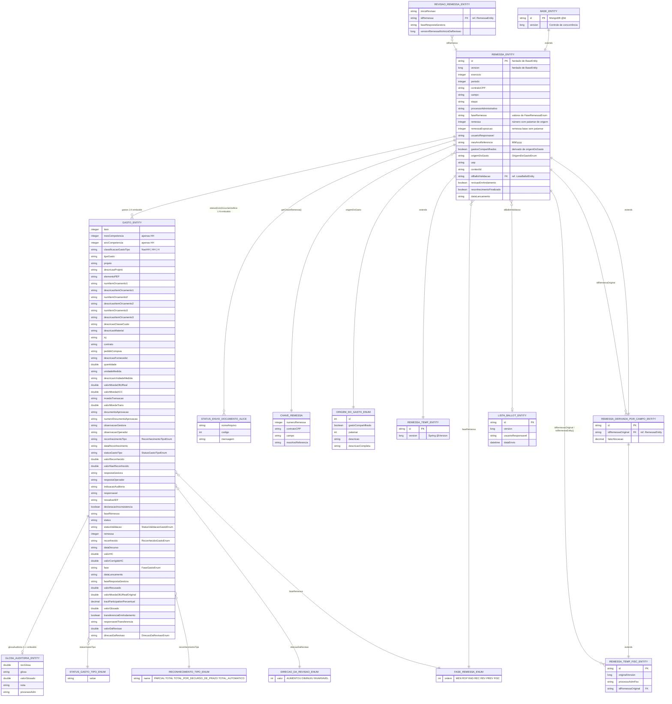

# RemessaEntity

🔍️ **Módulo:** `sgpp-services`  
📦️ **Pacote:** `sgpp.services.remessa`  
🗄️ **Coleção MongoDB:** `remessa_entity`  
🧬 **Ascendência:** `sgpp.services.common.BaseEntity`  
🏷️ **Anotações:** `@Document`, `@QueryEntity`, `@Data`, `@EqualsAndHashCode(callSuper = true)`

---

## Visão geral

`RemessaEntity` é o **agregado raiz** do domínio de remessas de gastos no SGPP. Representa uma remessa de custos em óleo associada a um contrato CPP, campo, exercício/período e fase do processo (MEN → FISC).

Os gastos (`GastoEntity`) e o status de envio de documentos ao Alice (`StatusEnvioDocumentoAlice`) são **embutidos** no documento MongoDB. Especializações temporárias e derivadas reutilizam o mesmo modelo via herança.

| Aspecto | Detalhe |
| --- | --- |
| Persistência | MongoDB — documento único por remessa |
| Identificação de negócio | `ChaveRemessa` (`remessa`, `contratoCPP`, `campo`, `mesAnoReferencia`) |
| Origem / patamar | `OrigemDoGastoEnum` define se o gasto é compartilhado e o patamar numérico da remessa |
| Ballot de validação | Referência lógica via `idBallotValidacao` → `ListaBallotEntity` |

---

## Diagrama Entidade-Relacionamento (DER)

O diagrama abaixo modela `RemessaEntity` e as classes/coleções mais diretamente relacionadas (composição embutida, herança e referências lógicas).

> 📎 **Recurso estático:** o mesmo diagrama Mermaid está versionado em [`/der/remessa-entity.mmd`](/der/remessa-entity.mmd) (`static/der/remessa-entity.mmd`).

---

## Classes e relacionamentos

### Agregado principal

| Classe | Coleção / papel | Relação com `RemessaEntity` |
| --- | --- | --- |
| `BaseEntity` | — | Superclasse (`id`, `version`) |
| `RemessaEntity` | `remessa_entity` | Agregado raiz |
| `GastoEntity` | embutido em `gastos` | Composição **1:N** |
| `GlosaAuditoriaEntity` | embutido em `GastoEntity.glosaAuditoria` | Composição **0..1** por gasto |
| `StatusEnvioDocumentoAlice` | embutido em `statusEnvioDocumentoAlice` | Composição **1:N** |
| `ChaveRemessa` | value object | Derivado de campos de negócio da remessa |

### Especializações e versões temporárias

| Classe | Coleção | Observação |
| --- | --- | --- |
| `RemessaTempEntity` | `remessa_temp_entity` | Extende `RemessaEntity`; staging temporário |
| `RemessaDerivadaPorCampoEntity` | `remessa_derivada_campo_entity` | Alocação por campo (`idRemessaOriginal`, `fatorAlocacao`) |
| `RemessaTempFiscEntity` | `remessa_temp_fisc_entity` | Extende a derivada; staging de fiscalização (`processoAdmFisc`) |

### Referências lógicas (outras coleções)

| Classe | Coleção | Vínculo |
| --- | --- | --- |
| `ListaBallotEntity` | `lista_ballot_entity` | `RemessaEntity.idBallotValidacao` |
| `RevisaoRemessaEntity` | `revisao_remessa_entity` | `idRemessa` + snapshot de `version` |

### Domínios controlados (enums)

| Enum | Uso principal |
| --- | --- |
| `OrigemDoGastoEnum` | Origem do gasto e patamar numérico da remessa (`GASTO_AEGV`, `GASTO_ATIVO_COMPARTILHADO`, `GASTO_EXCLUSIVO`, `GASTO_JAZIDA_COMPARTILHADA`) |
| `FaseRemessaEnum` | Ciclo de fase: `MEN`, `ROP`, `RAD`, `REC`, `REV`, `PREV`, `FISC` |
| `StatusGastoTipoEnum` | Status de reconhecimento do gasto (passível, reconhecido, recusado, etc.) |
| `ReconhecimentoTipoEnum` | Tipo de reconhecimento (`PARCIAL`, `TOTAL`, `TOTAL_AUTOMATICO`, …) |
| `DirecaoDaRevisaoEnum` | Direção da revisão de valor no gasto |

---

## Atributos de `RemessaEntity`

| Atributo | Tipo | Notas |
| --- | --- | --- |
| `id` | `String` | PK MongoDB (herdado) |
| `version` | `Long` | Concorrência otimista (herdado) |
| `exercicio` | `Integer` | Exercício fiscal |
| `periodo` | `Integer` | Período |
| `contratoCPP` | `String` | Contrato de partilha |
| `campo` | `String` | Campo / área |
| `etapa` | `String` | Etapa processual |
| `processoAdministrativo` | `String` | Processo administrativo |
| `faseRemessa` | `String` | Alinhado a `FaseRemessaEnum` |
| `remessa` | `Integer` | Número da remessa (pode incluir patamar) |
| `remessaExposicao` | `Integer` | Remessa base sem patamar (`definirPatamar()`) |
| `usuarioResponsavel` | `String` | Responsável |
| `mesAnoReferencia` | `String` | Formato `MM/yyyy` |
| `gastosCompartilhados` | `boolean` | Preenchido a partir de `origemDoGasto` |
| `gastos` | `List<GastoEntity>` | Gastos embutidos |
| `origemDoGasto` | `OrigemDoGastoEnum` | Origem / patamar |
| `uep` | `String` | UEP |
| `contextId` | `String` | Contexto de processo |
| `idBallotValidacao` | `String` | Ref. lógica a ballot |
| `revisaoEmAndamento` | `boolean` | Flag de revisão |
| `reconhecimentoFinalizado` | `boolean` | Flag de reconhecimento |
| `dataLancamento` | `String` | Data de lançamento |
| `statusEnvioDocumentoAlice` | `List<StatusEnvioDocumentoAlice>` | Status de envio Alice |

Classes internas de apoio a consulta: `RemessaEntity.ContratoCampo` e `RemessaEntity.ExercicioPeriodo`.

---

## Notas de modelagem

1. **Documento embutido vs. referência:** gastos e status Alice vivem no mesmo documento da remessa; ballot e revisão usam IDs entre coleções.
2. **Patamar da remessa:** `OrigemDoGastoEnum` aplica offset de 10 000/20 000/30 000 sobre a remessa base; `remessaExposicao` guarda o valor sem patamar.
3. **Views Jackson:** `ReconhecimentoView`, `FiscalizacaoView` e `InvisibleView` controlam projeção JSON (ex.: glosa e campos de transferência).
4. **Fiscalização:** `RemessaTempFiscEntity.toRemessaEntity()` reconsolida a remessa oficial a partir do staging de fiscalização.

---

## Ver também

- [ContaCustoOleoEntity](./conta-custo-oleo-entity.md) — CCO gerada a partir da remessa (`idRemessaGeradora`)
- [Modelo de Dados](./intro.md) — convenções da seção
