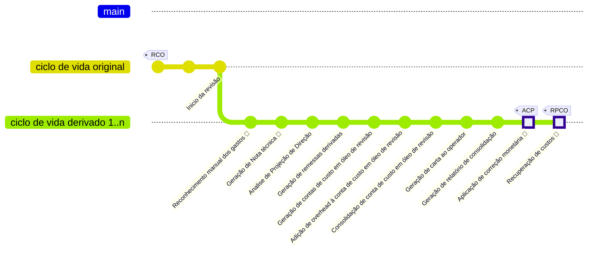
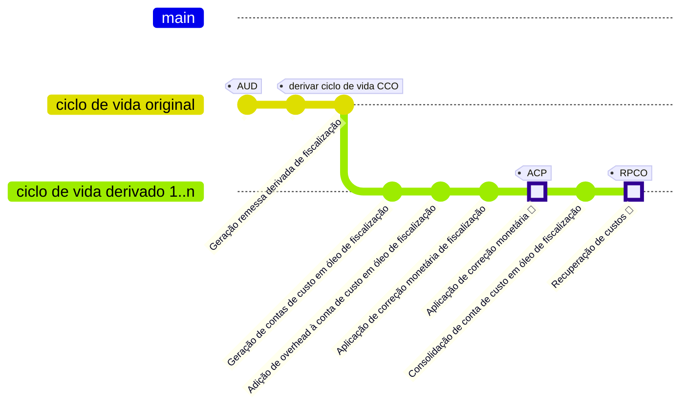

# Criação de Etapas do Ciclo de Vida de Contas de Custo em Óleo

🔍️ **Local de criação:** `sgpp-services`  
⌛️ **Tempo estimado:** 8 horas + tempo para desenvolver regra de negócio + tempo para desenvolver teste unitário da regra de negócio

---

## Etapas de Execução

### 1. Criar Classe de API REST

📦️ **Pacote:** `sgpp.services.web.rest`  
🏷️ **Nome:** Deve refletir o nome da etapa, iniciando com `Etapa` e terminando com `Resource`.  
📄 **Descrição:** Classe que expõe a etapa do ciclo de vida como API REST. Deve possuir apenas um método com a seguinte assinatura:

```java
sgpp.services.web.rest.EtapaAdicaoOverheadContaCustoOleoResource.executar(...)
```

🔹 Esse método deve:
- Receber todos os parâmetros necessários para a composição do input da etapa.
- Instanciar a classe de _Requisição_.
- Buscar na base os dados necessários para popular essa classe.
- Utilizar o método:
  ```java
  sgpp.services.service.EventStoreClient.addEtapa(EtapaBaseEvent)
  ```
  para adicionar a etapa na fila de execução.

💡 **Dica:** Faça com que os parâmetros do método `executar` sejam o mais resumidos possíveis. O estado da aplicação pode ser consultado na base de dados, então, sempre que possível, utilize identificadores como inputs.

---

### 2. Criar Classe de Requisição (Input de Dados) da Etapa

📦️ **Pacote:** `sgpp.ciclovidacco.etapas.[NomeDaEtapaCamelCase].[NumeroVersao]`  
🏷️ **Nome:** Deve refletir o nome da etapa, iniciando com `Etapa` e terminando com `Requisicao`.  
📤️ **Ascendência:** Deve estender `sgpp.ciclovidacco.etapas.EtapaRequisicao`.  
#️⃣ **Anotações:** Deve conter as anotações:
  - `@lombok.Data`
  - `@lombok.EqualsAndHashCode(callSuper = false)`
  - `@lombok.ToString`
  
📄 **Descrição:** Esta classe representa um _Value Object_ contendo todo o estado da regra de negócio modelada na etapa. Durante a execução da etapa, o estado da aplicação não deve ser consultado na base (com algumas exceções). Todos os objetos de valor devem ser atributos dessa classe.

▶️ **Métodos:** Deve conter um método de criação com a seguinte assinatura:

```java
public static [NomeDaClasse] criarEtapa(...)
```

#### 2.1. Definir o atributo como vínculo
📄 **Descrição:** Como o ciclo de vida tem a característica de ser reexecutado, é necessário definir um atributo que carrega as alterações realizadas pela etapa anterior. Para tanto, é necessário identificar esse atributo (que na maior parte das vezes é ou RemessaEntity ou ContaCustoOleoEntity).
Para realizar esa identificação, a seguinte anotação deve ser adicionada à esse atributo
```
@EtapaPreviaVinculo(value = "...", nomeItem = "...")
```
Como `value`deve ser passado o FQN da classe enquanto `nomeItem` deve ser passado o nome do atributo conforme ele é na etapa anterior

---

### 3. Criar Classe da Etapa

📦️ **Pacote:** `sgpp.ciclovidacco.etapas.[NomeDaEtapaCamelCase].[NumeroVersao]`  
🏷️ **Nome:** Deve refletir o nome da etapa.  
📤️ **Ascendência:** Deve estender `sgpp.ciclovidacco.etapas.EtapaImpl`.  
📄 **Descrição:** Classe que contém a regra de negócio e deve obedecer às seguintes diretrizes:
- **Idempotência:** Execuções consecutivas devem sempre alterar o estado da mesma forma, ou seja, sem efeitos colaterais indesejados.
- **Isolamento do Estado:** Não deve consultar o estado da aplicação diretamente. Todos os dados devem vir da classe _Requisicao_.
- **Tratamento de Exceções:** Toda execução deve ser encapsulada em um `try-catch` para capturar `java.lang.Exception`.

▶️ **Métodos:** Deve conter apenas um método público com a seguinte assinatura:

```java
public void executar(EtapaRequisicaoImpl etapaRequisicao)
```

#### 3.1. Definir o Método `executar` da Etapa

📄 **Descrição:** O método `executar` deve chamar os seguintes métodos:

- **Alteração de Estado:**
  ```java
  sgpp.services.service.EventoPendenteService.addEvent(BaseEvent, EtapaRequisicao)
  ```
  
- **Tratamento de Exceção:**
  ```java
  sgpp.ciclovidacco.etapas.EtapaImpl.lancarExcecaoConclusaoEtapa(CicloVidaCcoService, EtapaRequisicaoImpl, Exception)
  ```
  
- **Finalização da Etapa:** escolher o método de conclusão pelo **escopo** da etapa (ver seção [3.2](#32-conclusão-da-etapa-no-cvcco--qual-método-usar)). Não usar sempre o mesmo overload.

---

### 3.2. Conclusão da etapa no CVCCO — qual método usar

Classe: `sgpp.services.contacustooleo.ciclovida.CicloVidaCcoService`.

O orquestrador (BPM) costuma consultar `isEtapasConcluidas`, que exige **`dataConclusao` em todas as ocorrências** do nome da etapa no CVCCO. Por isso a conclusão deve **preencher o slot do template** (item aberto da etapa), e não apenas acrescentar uma cópia no fim da lista — senão o template fica aberto e `isConcluida` permanece `false`.

#### Escolha pelo escopo

| Escopo da etapa | Preferir | Observação |
|-----------------|----------|------------|
| **Uma CCO** por execução, com **várias CVCCO** no mesmo `contextId` (ex.: OH/CM de fiscalização) | `adicionarEtapaConcluida(etapa, idContaCustoOleo, faseRemessa)` | Isola a conclusão na CVCCO daquela CCO. Preenche o slot aberto do template; só appenda se não houver item aberto. |
| **Uma remessa** (`idRemessa` conhecido, 1 CVCCO por remessa) | `concluirEtapa(etapa, idRemessa, faseRemessa)` | Localiza o item da etapa e conclui. |
| **Lote / processo** (todas as CVCCO do `contextId` juntas) | `concluirEtapa(etapa, faseRemessa)` | Marca a etapa em **todas** as CVCCO do contextId — só use se isso for o desejado. |
| Etapa **gera a CCO** e grava o id no ciclo | `concluirEtapaGeradoraDeCco(...)` | |
| **Consolidação** multi-CCO → CVCCO consolidado | `concluirEtapaConsolidandoCvccos(...)` | |

#### Regras práticas

1. Etapas novas (e refatorações) com processamento **por conta** → usar `adicionarEtapaConcluida(etapa, idCco, fase)`.
2. Sempre passar **`FaseRemessaEnum`** quando não for o fluxo regular MEN (`AUD`, fases de revisão, etc.), para buscar na collection certa (fisc/rev/regular).
3. O check `isConcluida` no BPM deve usar o **mesmo escopo** da conclusão (lista de ids de CCO vs `contextId`).
4. **Não** unificar tudo em um único método:
   - `adicionarEtapaConcluida(etapa, fase)` (só contextId) e `concluirEtapa(etapa, fase)` afetam o **lote** do contextId — inadequados quando há várias CCO em paralelo no mesmo contextId.
   - O nome `adicionarEtapaConcluida(..., idCco, fase)` engana: após a correção, ele **conclui o item certo** (template aberto), não “só adiciona” no fim.

#### Anti-padrão a evitar

```java
// ❌ Várias CCO no mesmo contextId: conclui o lote inteiro cedo demais
cicloVidaCcoService.concluirEtapa(etapaRequest, FaseRemessaEnum.AUD);

// ❌ Append cego sem idCco quando o orquestrador espera conclusão por conta
// (deixa o slot template sem dataConclusao → isConcluida = false)

// ✅ Escopo por CCO (fiscalização OH/CM, etc.)
cicloVidaCcoService.adicionarEtapaConcluida(etapaRequest, idContaCustoOleo, FaseRemessaEnum.AUD);
```

---

### 4. Atualizar a Criação do Ciclo de Vida de Contas de Custo em Óleo

▶️ **Métodos:** Modificar o método:

```java
sgpp.services.contacustooleo.ciclovida.CicloVidaCcoService.createCicloVidaDefault(FaseRemessaEnum, String, boolean iniciadoEmFaseRecursiva)
```

🔹 Esse método deve considerar em qual processo a etapa será ativada e utilizar:

```java
sgpp.services.contacustooleo.ciclovida.CicloVidaCcoEntity.adicionarEtapaNoFim(CicloVidaCcoEtapaEnum, CicloVidaCcoEtapaVersaoLogicaEnum, CicloVidaCcoEtapaVersaoRequisicaoEnum)
```

🔹 Criar um item correspondente na enumeração:

```java
sgpp.services.contacustooleo.ciclovida.CicloVidaCcoEtapaEnum
```

para representar a nova etapa.

---

### 5. Atualizar o Diagrama do Estado Atual do Ciclo de Vida de Contas de Custo em Óleo

📄 **Descrição:** Atualizar o diagrama do ciclo de vida abaixo e substituir a imagem abaixo:

#### Ciclo de vida de CCO não recursal (MEN) ####


#### Ciclo de vida de CCO de revisão ####


#### Ciclo de vida de CCO de auditoria ####


### 6. Atualização e Versionamento de Etapas

📄 **Descrição:** Toda etapa vive em um pacote de versão (ex.: `v1_0_0` / `v1_1_0`). A decisão de **criar versão nova** vs **alterar a versão atual** segue **compatibilidade**: só versionar quando o código da etapa (ou payloads já enfileirados/persistidos) **não funciona mais sem mudanças** que quebrem o contrato antigo.

#### 6.1. Critério principal — compatibilidade

Pergunta-guia:

> Um payload / _Requisição_ no formato **antigo** ainda seria processado corretamente pelo código **novo** da etapa **sem** adaptador e **sem** quebrar o runtime?

| Resposta | Ação |
|----------|------|
| **Sim** (compatível) | **Não versionar.** Alterar as classes no pacote da versão vigente. |
| **Não** (incompatível) | **Versionar.** Novo pacote + adaptador de requisição (ver 6.3). |

Ou seja: mudança na _Requisição_ **por si só** **não** obriga versão nova. O que obriga é **quebra de compatibilidade** com o contrato anterior.

#### 6.2. Quando **não** versionar (evoluir no pacote atual)

Exemplos típicos de mudança **compatível** (manter `vX_Y_Z`):

- **Adicionar** atributos opcionais na _Requisição_ (código antigo não enviava; código novo trata `null` / default).
- **Adicionar** lógica de negócio que não exige campos novos obrigatórios no payload antigo.
- Correção de bug, refatoração interna, logs, idempotência — **mesmo shape** de input.
- Ajustes que o deserializador / `convertEtapa` aceitam sem falhar em mensagens já na fila no formato antigo.

#### 6.3. Quando **versionar** (novo pacote)

Crie versão nova quando o contrato antigo **deixa de ser válido** para o código novo, por exemplo:

- **Remover** ou **renomear** atributos da _Requisição_ usados no fluxo.
- Tornar **obrigatório** um campo que antes era opcional / ausente (payload antigo quebra ou comporta-se de forma errada).
- **Mudar tipo / semântica** de um campo de forma que o valor antigo seja interpretado incorretamente.
- Reescrever a regra de negócio de modo que o input antigo **não** produza o mesmo efeito esperado sem conversão explícita.
- Qualquer alteração em que o replay / reprocessamento de eventos antigos **precise** de `AdaptadorEtapaRequisicao` para virar o formato novo.

#### 6.4. Procedimento quando versionar

1. Criar pacote da nova versão (ex.: `v1_1_0`).
2. Duplicar as classes da versão anterior no pacote novo.
3. A nova versão **não** deve depender de classes de implementação da versão antiga (exceto payloads de requisição mantidos para adaptação).
4. Classes da versão antiga (exceto as que compõem o **payload da Requisição**) devem ser removidas da base. Assume-se que replay passa por **conversão**; os payloads antigos ficam para o adaptador.
5. Criar adaptador estendendo:

   ```java
   sgpp.ciclovidacco.etapas.adaptacao.AdaptadorEtapaRequisicaoAbstract<ORIGEM, ALVO>
   ```

6. Anotar (versão origem → alvo):

   ```java
   @Adaptacao(versaoOrigem = "1.0.0", versaoAlvo = "1.1.0")
   ```

7. Implementar:

   ```java
   AdaptadorEtapaRequisicaoAbstract.converter(ORIGEM)
   ```

   convertendo a _Requisição_ antiga para a nova.

#### 6.5. Resumo

```text
Mudança compatível com payload/código antigo?  →  editar versão atual
Mudança exige outro contrato ou conversão?     →  nova versão + adaptador
```

Não versionar “por precaução” a cada atributo novo; versionar quando **sem** versão/adaptador o fluxo antigo **quebraria** ou **mentiria** no resultado.

